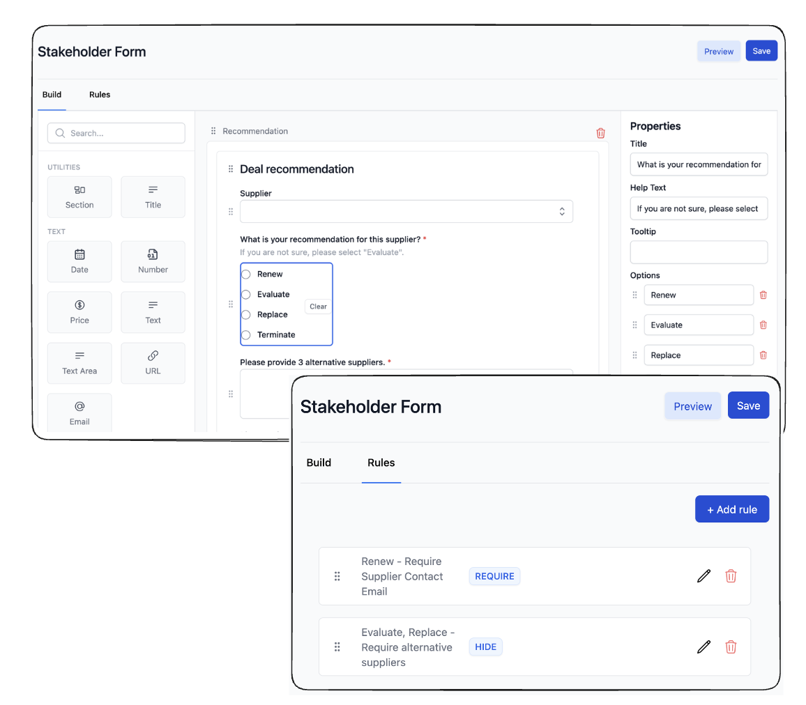

# Forms Product for Procurement Workflows

I led the development of a comprehensive forms product that allows procurement organizations to create and manage custom data collection workflows.

## 1. Flexible and Extensible Data Model

Researched and designed a flexible and extensible data model to support complex form structures.

- Organizations can create and customize forms with different page layouts, sections, and fields.
- Forms can support either single or multi-submissions.
- Forms can pull data from other product entities.

This allows organizations to create highly customized forms for their specific business needs. For example, a performance review form may require multiple submissions to gather input from different users, while a renewal form might be a single submission where multiple users contribute data relevant to their expertise.

## 2. Advanced Features

Researched and designed key features, including multi-submission support, a rules/conditions engine, and data linking with other product entities.
- Enables users to submit forms individually or in bulk.
- Allows forms to be linked to specific deals or suppliers, so users can view submissions and responses in context and leverage data from those entities.
  
## 3. Automation with Rules and Conditions

Researched and designed a rules and conditions engine, such that users can automate form behavior, such as field visibility, calculations, and validations. Investigated other tools approaches to this such as Jotform and Typeform.

By delivering this flexible and feature-rich forms product, we've empowered our customers to digitize their data collection processes and streamline deal tracking operations.

