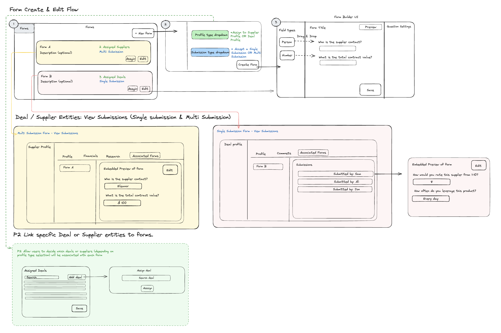

# Comprehensive Forms Product for Procurement

I led the development of a comprehensive forms product that allows procurement organizations to create and manage custom data collection workflows.

## 1. Flexible and Extensible Data Model

Researched and designed a flexible and extensible data model to support complex form structures. Organizations can create and customize forms with different page layouts, sections, and fields. Forms can be set up for single or multi-submissions. This allows organizations to build highly tailored forms to meet their unique business needs.

## 2. Advanced Features

Researched and designed advanced features like multi-submission support, rules/conditions engine, and integrations with other data entities. Users can submit forms, either individually or in bulk. The forms can be linked to specific deals or supplier entities, allowing users to view form submissions and responses in the context of those entities and leverage data from those entities.

## 3. Automation with Rules and Conditions

Researched and designed a rules and conditions engine, such that users can automate form behavior, such as field visibility, calculations, and validations. Investigated other tools approaches to this such as Jotform and Typeform.

By delivering this flexible and feature-rich forms product, we've empowered our customers to digitize their data collection processes and streamline deal tracking operations.
