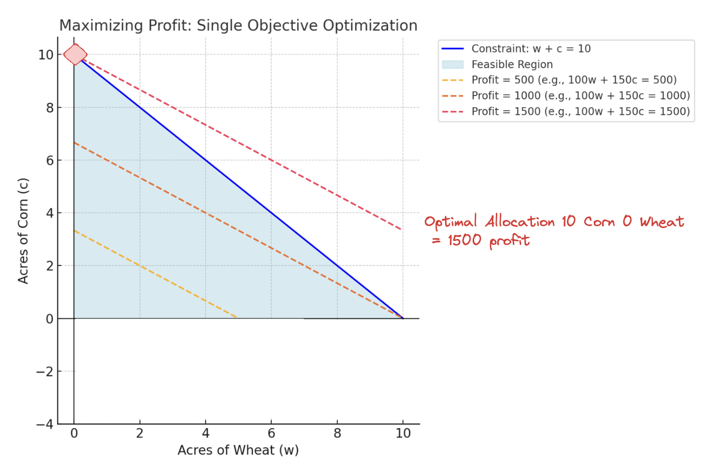

# What is Optimization?

**Optimization** is the process of finding the best solution to a problem from a set of possible solutions. It involves choosing the values of certain variables (called **decision variables**) to either:

- **Maximize** something desirable (like profit, efficiency, or happiness), and/or  
- **Minimize** something undesirable (like cost, time, or waste)  

while satisfying certain **constraints** (rules or limits) imposed by the problem.

*If you need a refresher on optimization, jump to sections 2 & 3 sections.*

---

  
 1) Equity Portfolio Optimization: Maximizing ESG Ratings and Minimizing Risk 

Let’s apply optimization to a financial portfolio to build or adjust a mix of investments (like stocks or other securities) to meet specific goals and rules. Tools like **Aladdin** help investors set up this problem by defining an **objective function (goals)** and **constraints (rules)**. Then, the tool finds the **best mix of investments** that satisfies all these requirements.

## **Portfolio Optimization Problem**

Imagine you currently hold the following portfolio of 2 stocks:

| **Stock** | **Current Weight** | **New Weight (xᵢ)** | **ESG Score (eᵢ)** | **Risk/Volatility (σᵢ)** | **Sector**       |  
|-----------|--------------------|---------------------|--------------------|--------------------------|------------------|  
| A         | 50% (0.5)          | x₁                  | 90                 | 8%                       | Technology       |  
| B         | 50% (0.5)          | x₂                  | 70                 | 7%                       | Energy           | 
| C         | 50% (0.5)          | x₂                  | 70                 | 7%                       | Energy           | 
 

Here:  
- **Current Weight** represents your initial allocation to each stock.  
- You can **buy or sell** to adjust these weights, but they must still add up to 100% (1.0).  
- The **decision variables** `x₁, x₂, x₃, x₄` represent the updated portfolio weights. They represent the new proportions of your budget invested in Stocks A, B, C, and D **after** optimizing.  

### Objective Function: Balancing ESG Scores and Risk  

Your goal with this portfolio is to **maximize ESG scores** while **minimizing portfolio risk**. Using the following function:

`Z(x) = α · E(x) - β · V(x)`  

Where: 

- **α** = ?  
Determined by user's priorities. Controls how much importance is placed on maximizing ESG scores. The larger `α` is relative to 'β' means there is more focus on maximizing sustainability.

- **E(x)** = Total ESG score = Σ(eᵢ · xᵢ)  
This is the overall ESG score of the portfolio, based on how much money is allocated to each stock and its individual ESG score. Stocks with higher ESG scores or larger portfolio weights contribute more to the total ESG score.

- **β** = ?  
Determined by user's priorities. Controls how much importance is placed on minimizing risk. The larger `β` is relative to 'α' means more focus on reducing volatility.

- **V(x)** = Total portfolio risk = Σ(σᵢ · xᵢ)  
This is the overall risk (volatility) of the portfolio (weighted sum of asset volatilities), based on how much is invested in each stock and how risky it is. Stocks with higher risk or larger weights increase the total portfolio risk more.

---

### **Constraints**
While trying to achieve your goal, you need to maintain certain rules.

1. **Energy Sector Allocation**:  
   The energy sector (in this case only Stock B) must make up between 10% and 20% of the portfolio as stipulated by your portfolio's mandate: `0.1 ≥ x₂ ≥ 0.2`.

2. **Non-Negativity**:  
   You can’t sell short, so all weights must be non-negative. In other words, this portfolio's mandate is long-only: `x₁, x₂, x₃, x₄ ≥ 0`.

3. **Fully Invested**:  
   100% of the available investment capital is allocated, in other words, there should be no uninvested cash: `x₁ + x₂ + x₃ + x₄ = 1`.

4. **Cardinality Constraint**:  
   The portfolio must consist of exactly 3 positions after optimization, meaning only 3 of the 4 stocks can have non-zero weights:  
   `I₁ + I₂ + I₃ + I₄ = 3`, where `Iᵢ` is a binary indicator (1 if stock `i` is included, 0 otherwise).

---

### Solving using an Optimization Algorithm  

Given the objectives and constraints, the final problem we need to solve is:

**Maximize:**  
`Z(x) = α⋅(90x₁ + 70x₂) − β⋅(0.08x₁ + 0.07x₂)`

**Subject to:**  
1. `0.1 ≥ x₂ ≥ 0.2`  
2. `x₁, x₂, x₃, x₄ ≥ 0`  
3. `x₁ + x₂ + x₃ + x₄ = 1`  
4. `I₁ + I₂ + I₃ + I₄ = 3`

**Maximize:**  
`Z(x) = α⋅(90x₁ + 80x₂ + 70x₃ + 60x₄) − β⋅(0.08x₁ + 0.06x₂ + 0.05x₃ + 0.04x₄)`

**Subject to:**  
1. `0.1 ≥ x₂ ≥ 0.2`  
2. `x₁, x₂, x₃, x₄ ≥ 0`  
3. `x₁ + x₂ + x₃ + x₄ = 1`  
4. `I₁ + I₂ + I₃ + I₄ = 3`  

Optimization solvers are algorithms designed to find the best solution to this problem by fine-tuning decision variables (e.g., `x₁, x₂, ..., x₅`) in an iterative process. These solvers start with an initial guess and gradually refine it until they reach the optimal solution that maximizes or minimizes the objective function while satisfying all constraints. 

#### Steps in the Optimization Process:

1. **Initial Guess (Starting Point):**  
   The solver begins by selecting an initial set of values for the decision variables, such as initial portfolio weights.

2. **Iterative Refinement:**  
   The solver makes small adjustments to the variables and evaluates the new solution:  
   - Does the change improve the objective (e.g., higher ESG score or lower risk)?  
   - Are all constraints still satisfied?  

   If the new combination is better, the solver moves in that direction and continues tweaking the values.

3. **Convergence to the Best Solution:**  
   The process continues until the solver reaches a stopping condition, such as when improvements become negligible (e.g., the change in the objective value is below a defined threshold).

---

### Example Solution:

| **Stock** | **Current Weight** | **New Weight (xᵢ)** | **Change** |  
|-----------|--------------------|---------------------|------------|  
| A         | 0.4                | 0.35                | -0.05      |  
| B         | 0.35               | 0.5                 | +0.15      |  
| C         | 0.25               | 0.25                | 0          |  

### Evaluating the Solution

1. **Total ESG Score**:  
`E(x) = (90 · 0.35) + (80 · 0.4) + (70 · 0.25)`  
`E(x) = 31.5 + 32 + 17.5 = 81`

2. **Total Risk**:  
`V(x) = (8% · 0.35) + (6% · 0.4) + (5% · 0.25)`  
`V(x) = 2.8% + 2.4% + 1.25% = 6.45%`

3. **Objective Function**:  
`Z(x) = (2 · 81) - (1 · 6.45)`  
`Z(x) = 162 - 6.45 = 155.55`

---

### Key Takeaways  

This example highlights how portfolio optimization works by **rebalancing existing holdings** to achieve specific goals—**maximizing ESG scores** and **minimizing risk**—while adhering to constraints like sector requirements.  

---

  
 2) Single Objective Example: Maximizing Profit (Simple Case)

Imagine you're a farmer with 10 acres of land. You can plant **wheat** or **corn**:

- Wheat gives **$100 profit per acre**.
- Corn gives **$150 profit per acre**.
- Your goal is to **maximize profit**, but you only have 10 acres to work with.

### Variables
- `w`: Acres of wheat planted.  
- `c`: Acres of corn planted.  

### Objective
- Maximize profit:  
  `p(w, c) = 100w + 150c`

### Constraint
- Total land available:  
  `w + c <= 10`
- Cannot have negative land:
  w >= 0 and c >= 0

---

### Solution Intuition

Corn is more profitable, so to maximize profit, you should plant all 10 acres with corn. This gives the highest possible profit:  
`p(0, 10) = 150 * 10 = 1500`

---

  
 3) Multi-Objective Example: Maximizing Profit and Minimizing Water Usage

Now let’s add another consideration: **water is scarce**. Corn uses **4 units of water per acre**, while wheat uses only **2 units per acre**. You now have two objectives:

1. **Maximize profit**:  
   `p(w, c) = 100w + 150c`

2. **Minimize water usage**:  
   `h(w, c) = 2w + 4c`

---

### The Trade-Off

Corn gives more profit but uses more water. Wheat uses less water but gives lower profit. You can’t do both perfectly, so you need to find a **balance**.

---

### Balancing Profit and Water Usage

To balance these goals, you combine them into a single formula:  
`Z(w, c) = α * p(w, c) - β * h(w, c)`

Here:
- `α`: Weight for profit (how important profit is).  
- `β`: Weight for water conservation (how important it is to conserve water).

The weights `α` and `β` in the formula act as scalars that determine the relative importance of the two objectives. For example, if `α = 2` and `β = 1`, you are telling the objective function that maximizing profit is twice as important as minimizing water consumption.

---
### Key Scenarios

- **If profit is more important (`α > β`)**:  
  Plant mostly corn to maximize profit, even if water usage is higher.

- **If water conservation is more important (`β > α `)**:  
  Plant mostly wheat to use less water, even if profit is lower.

---

### Example Objective Weights and Outcomes

1. **Maximizing Profit (`α = 1, β = 0.1`)**:  
   Focus on profit. Plant all 10 acres with corn:  
   - Profit: $1500  
   - Water usage: 40 units.

2. **Balancing Both (`α = 1, β = 0.5`)**:  
   Balance profit and water use. Split land (4 acres wheat, 6 acres corn):  
   - Profit: $1300  
   - Water usage: 32 units.

3. **Minimizing Water (`α = 1, β = 1`)**:  
   Focus on water conservation. Plant all 10 acres with wheat:  
   - Profit: $1000  
   - Water usage: 20 units.

---

### Insights

Optimization often involves trade-offs. By adjusting weights (`α, β`), you can explore how much you prioritize one goal over another. This approach allows you to find the solution that best fits your overall needs.

---

  
 Equity Portfolio Optimization: Maximizing ESG Ratings and Minimizing Risk 

Let’s apply these principles to **portfolio optimization**, which is used to build or adjust a mix of investments (like stocks or other securities) to meet specific goals and rules. Tools like **Aladdin** help investors set up this problem by defining their **goals** and **constraints**. Then, the tool finds the **best mix of investments** that satisfies all these requirements.

## **Portfolio Optimization Problem**

Imagine you currently hold the following portfolio of 3 stocks:

| **Stock** | **Current Weight** | **New Weight (xᵢ)** | **ESG Score (eᵢ)** | **Risk/Volatility (σᵢ)** | **Sector**       |  
|-----------|--------------------|---------------------|--------------------|--------------------------|------------------|  
| A         | 25% (0.25)         | x₁                  | 90                 | 8%                       | Technology       |  
| B         | 50% (0.2)          | x₂                  | 80                 | 6%                       | Energy           |  
| C         | 25% (0.15)         | x₃                  | 70                 | 5%                       | Healthcare       |  

Here:  
- **Current Weight** represents your initial allocation to each stock.  
- You can **buy or sell** to adjust these weights, but they must still add up to 100% (1.0).
- The **decision variables** `x₁, x₂, x₃, x₄, x₅` are the updated portfolio weights. They represent the new proportions of your budget invested in Stocks A, B, C, D, and E after optimizing.  

### Objective Function: Balancing ESG Scores and Risk  

Your goal with this portfolio is to **minimize risk** where: 

`Z(x) = V(x)`  

- **V(x)** = Total portfolio risk = Σ(σᵢ · xᵢ) (weighted sum of asset volatilities).

### **Constraints**
While trying to achieve your goal, you need to maintain certain constraints.

1. **Non-Negativity**:  
  You can’t sell short, so all weights must be non-negative: x₁, x₂, x₃ ≥ 0

2. **Fully Invested**:
   100% of the available investment capital is allocated, in onther words the total weights must sum to 1: x₁ + x₂ + x₃ = 1

3. **Diversification Threshold**:
  This constraint limits portfolio concentration by requiring the sum of squared weights to be less than 0.5. For example, if you try to put 80% in one stock, the squared value 
  (0.64) would exceed the 0.5 limit, forcing more balanced allocations across stocks: x₁² + x₂² + x₃² + x₄² ≤ 0.5

1. **Maximizes ESG scores** (`E`) – focuses on sustainable and socially responsible investments.  
2. **Minimizes risk** (`V`) – reduces the chance of large fluctuations in returns (**volatility**).  

Using the following function:

`Z(x) = α · E(x) - β · V(x)`  

Where:  
- **E(x)** = Total ESG score = Σ(eᵢ · xᵢ) (weighted sum of ESG scores).  
- **V(x)** = Total portfolio risk = Σ(σᵢ · xᵢ) (weighted sum of asset volatilities).   
- **`α`**: Weight for ESG scores (importance of sustainability).  
- **`β`**: Weight for risk (importance of reducing volatility).  
 
---

### **Constraints**
While trying to achieve your goal, you need to maintain certain constraints.

1. **Energy Sector Allocation**:  
   Stocks B and D (Energy) must make up at least 15% of the portfolio: x₂ + x₄ ≥ 0.15

2. **Non-Negativity**:  
  You can’t sell short, so all weights must be non-negative: x₁, x₂, x₃, x₄, x₅ ≥ 0

3. **Fully Invested**:
   100% of the available investment capital is allocated, in onther words the total weights must sum to 1: x₁ + x₂ + x₃ + x₄ + x₅ = 1

---

### 4. Solve using an Optimization Algorithm  

Optimization solvers use smart algorithms to find the best solution by fine-tuning the decision variables (e.g., `x₁, x₂, ..., x₅`) step by step. They start with an initial guess and gradually improve it until an optimal result is reached.  

1. **Start with a Starting Point**:  
   The solver picks an initial set of values for the variables (e.g., initial weights for a portfolio).  

2. **Make Iterative Adjustments**:  
   The solver tweaks the values slightly and checks:  
   - Does this new combination improve the objective (e.g., higher ESG score or lower risk)?  
   - Are all the rules (constraints) still followed?  

3. **Find the Best Solution**:  
   The solver keeps refining the values until it can’t make meaningful improvements or it meets a set stopping condition (like a tiny improvement threshold).  

---

### Common Approaches  
- **Linear Programming (LP)**:  
   Used when the problem and constraints are simple, straight-line relationships.  
- **Gradient Descent**:  
   A step-by-step method that adjusts the variables by moving in the “best direction” to improve the result as quickly as possible.  

---

In short, solvers act like smart navigators: they explore possible solutions, compare them, and zero in on the best answer while respecting all the given rules.  

Let’s assume the solution is as follows:

| **Stock** | **Current Weight** | **New Weight (xᵢ)** | **Change** |  
|-----------|--------------------|---------------------|------------|  
| A         | 0.25               | 0.2                 | -0.05      |  
| B         | 0.2                | 0.15                | -0.05      |  
| C         | 0.15               | 0.25                | +0.10      |  
| D         | 0.2                | 0.25                | +0.05      |  
| E         | 0.2                | 0.15                | -0.05      |  

---

### Step 5: Evaluate the Solution

1. **Total ESG Score**:  
E(x) = (90 · 0.2) + (80 · 0.15) + (70 · 0.25) + (85 · 0.25) + (60 · 0.15) E(x) = 18 + 12 + 17.5 + 21.25 + 9 = 77.75

2. **Total Risk**:  
V(x) = (8% · 0.2) + (6% · 0.15) + (5% · 0.25) + (7% · 0.25) + (4% · 0.15) V(x) = 1.6% + 0.9% + 1.25% + 1.75% + 0.6% = 6.1%

3. **Objective Function**:  
Z(x) = (2 · 77.75) - (1 · 6.1) = 155.5 - 6.1 = 149.4

---

### Key Takeaway  

This example highlights how portfolio optimization works by **rebalancing existing holdings** to achieve specific goals—**maximizing ESG scores** and **minimizing risk**—while adhering to constraints like sector requirements.  

#### Key Insights:  
1. **Improved ESG and Managed Risk**:  
   By reallocating more funds to higher-ESG stocks, the portfolio achieved a higher total ESG score while keeping the risk increase modest at **6.1%**.  

2. **Constraint Satisfaction**:  
   Energy stocks (B and D) now account for **40%** of the portfolio, exceeding the minimum 15% requirement.  

3. **Efficiency and Flexibility**:  
   Minimal adjustments kept transaction costs low, while tuning weights (e.g., `α` for ESG and `β` for risk) allowed for a balanced trade-off between sustainability and volatility.  

Just as a farmer balances **profit (ESG scores)** and **water usage (risk)**, investors can customize optimization tools like **Aladdin** to seamlessly integrate priorities and constraints, ensuring efficient, data-driven solutions.  

