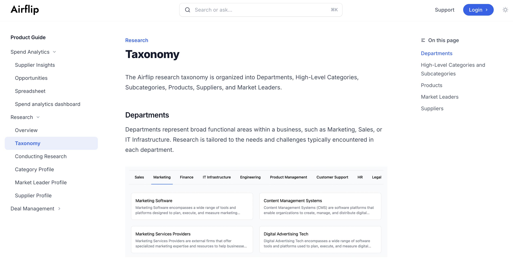

# Airflip Website & Documentation Redesign

## Enhanced Product Messaging and Call-to-Actions
1. Refining Messaging: I conducted a competitive analysis and applied a messaging framework to clearly articulate Airflip's core benefits. The refined messaging highlights how the platform streamlines workflows, enhances productivity, and uses AI to automate tasks in a way that resonates with the target audience.
2. Improving Call-to-Actions: I updated the site’s language around Airflip's AI capabilities to make it more approachable. Call-to-actions were made more compelling by revising button text, adjusting placement, and enhancing visual elements to drive user engagement.

## Comprehensive Public Documentation
1. Building a Robust Help Site: I developed a detailed documentation site hosted at help.airflip.com using Mintlify. This site includes in-depth product writeups and terminology guides, structured intuitively to address user needs and incorporate feedback to resolve common pain points.
2. Integrated In-Product Links: Each help page is directly linked to the corresponding area of the platform, ensuring users can access relevant guidance seamlessly while using the product.

## Dynamic Workflow Visuals with Screen Studio
To showcase Airflip's features, I created a series of workflow videos and animated visuals using Screen Studio. These provide step-by-step demonstrations, making the platform’s capabilities easy to understand and visually engaging.

## Results
- Website engagement increased by 15%.
- Airflip's market positioning was strengthened.
- Customer feedback highlighted that the public documentation effectively answered their questions, significantly reducing inbound inquiries.
